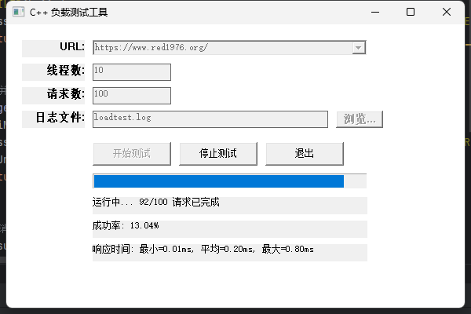

# C++ 负载测试工具 (CppLoadTester)



## 项目简介

CppLoadTester 是一个基于 C++ 开发的轻量级 HTTP 负载测试工具，类似于 Apache JMeter 但更轻量，专门为 Windows 平台设计。它允许用户通过简单的界面配置和执行对 HTTP 服务的并发请求测试，实时监控测试进度和性能指标。

## 功能特点

- 简洁易用的 Windows 原生 GUI 界面
- 支持多线程并发请求
- 可自定义请求数量和并发线程数
- 实时显示请求完成进度和成功率
- 记录最小、最大和平均响应时间
- 自动保存配置和最近使用的 URL
- 详细日志记录每个请求的结果
- 支持 HTTPS 和各种 HTTP 方法

## 系统要求

- Windows 7 或更高版本
- Visual Studio 2019 或 MinGW 编译器
- CMake 3.10 或更高版本
- libcurl 库 (通过 vcpkg 管理)

## 构建说明

### 使用 vcpkg 安装依赖

```bash
# 克隆 vcpkg 仓库（如果尚未安装）
git clone https://github.com/microsoft/vcpkg.git
cd vcpkg
# 安装 vcpkg
bootstrap-vcpkg.bat
# 安装 curl 依赖
vcpkg install curl:x64-windows
```

### 构建项目

```bash
# 克隆本项目
git clone https://github.com/yourusername/CppLoadTester.git
cd CppLoadTester

# 创建构建目录
mkdir build
cd build

# 使用 CMake 配置项目 (使用 vcpkg)
cmake -DCMAKE_TOOLCHAIN_FILE=[vcpkg路径]/scripts/buildsystems/vcpkg.cmake ..

# 构建项目
cmake --build . --config Release
```

或者，您可以使用 CLion、Visual Studio 或其他支持 CMake 的 IDE 直接打开项目文件夹并构建。

## 使用方法

1. 启动应用程序
2. 在 URL 输入框中输入目标 Web 服务的地址
3. 设置并发线程数和总请求数
4. 指定日志文件的保存位置
5. 点击「开始测试」按钮开始负载测试
6. 在界面上实时监控测试进度和结果
7. 测试完成后，检查详细的响应时间统计和成功率

## 项目结构

```
CppLoadTester/
├── include/                  # 头文件
│   ├── AppConfig.h          # 应用配置类
│   ├── LoadTester.h         # 负载测试器核心类
│   └── UIManager.h          # UI 管理器类
├── src/                      # 源文件
│   ├── AppConfig.cpp        # 应用配置实现
│   ├── LoadTester.cpp       # 负载测试器实现
│   ├── main.cpp             # 主入口
│   └── UIManager.cpp        # UI 管理器实现
├── CMakeLists.txt           # CMake 构建配置
└── README.md                # 本文件
```

## 贡献

欢迎贡献代码、报告问题或建议改进方案！可以通过以下方式参与：

1. Fork 本仓库
2. 创建您的特性分支 (`git checkout -b feature/amazing-feature`)
3. 提交您的更改 (`git commit -m 'Add some amazing feature'`)
4. 推送到分支 (`git push origin feature/amazing-feature`)
5. 创建新的 Pull Request

## 许可证

此项目基于 MIT 许可证发布 - 详情请参见 [LICENSE](LICENSE) 文件。

## 致谢

- [libcurl](https://curl.se/libcurl/) - 强大的 HTTP 客户端库
- [vcpkg](https://github.com/microsoft/vcpkg) - C++ 包管理器