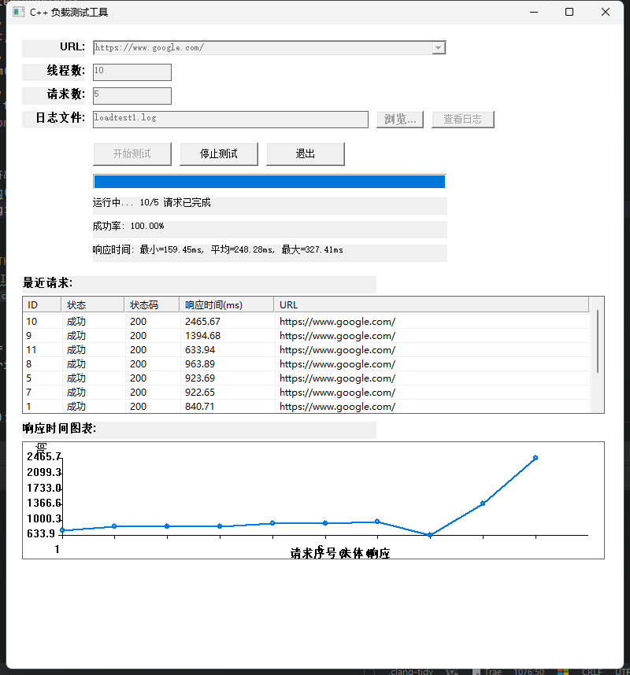

# C++ 负载测试工具 (CppLoadTester)

一个基于C++开发的轻量级HTTP负载测试工具，为Windows平台优化设计，提供直观的图形界面和实时测试反馈。



## 功能特点

- **简洁易用的界面**：原生Windows GUI，操作简单直观
- **多线程并发请求**：支持自定义线程数和请求总数
- **实时状态监控**：
    - 彩色列表显示每个请求的状态和响应时间
    - 实时更新的响应时间图表
    - 进度条和成功率显示
- **详细测试结果**：
    - 最小、最大、平均响应时间统计
    - 每个请求的状态码和响应时间
    - 可查看测试日志记录
- **配置保存**：自动记忆最近使用的URL和设置
- **错误处理**：详细的错误状态显示和异常处理

## 系统要求

- Windows 7/8/10/11
- 支持的编译器：
    - Visual Studio 2019/2022
    - MinGW-w64 (GCC 8.0+)
- CMake 3.10+
- libcurl

## 编译说明

### 准备环境

1. 安装CMake
2. 安装vcpkg（可选，用于管理依赖）
3. 安装libcurl（可通过vcpkg安装）

```bash
# 使用vcpkg安装libcurl
vcpkg install curl:x64-windows
```

### 编译项目

使用CMake构建项目：

```bash
# 创建构建目录
mkdir build
cd build

# 配置项目
cmake -DCMAKE_TOOLCHAIN_FILE=[vcpkg路径]/scripts/buildsystems/vcpkg.cmake ..

# 构建项目
cmake --build . --config Release
```

或者使用IDE（如Visual Studio、CLion等）打开项目文件夹，配置CMake项目后直接构建。

## 使用方法

1. 启动程序

2. 配置测试参数：
    - **URL**：要测试的目标网址
    - **线程数**：并发请求的线程数
    - **请求数**：要发送的总请求数
    - **日志文件**：测试日志的保存位置

3. 点击"开始测试"按钮启动测试

4. 观察测试进度和实时结果：
    - 进度条显示整体完成进度
    - 彩色列表显示每个请求的状态（绿色=成功，橙色=失败，红色=错误）
    - 图表区域显示响应时间变化趋势

5. 测试完成后，可以：
    - 查看完整的统计结果
    - 点击"查看日志"按钮查看详细日志内容

## 技术细节

- 使用C++17标准
- 基于Win32 API构建原生GUI界面
- 使用libcurl进行HTTP请求
- 多线程并发执行请求
- 实时图表绘制
- Unicode全面支持（支持中文和其他语言）

## 代码结构

```
CppLoadTester/
├── include/                  # 头文件
│   ├── AppConfig.h          # 应用配置类
│   ├── LoadTester.h         # 负载测试器核心类
│   ├── StringConversion.h   # 字符串转换工具
│   └── UIManager.h          # UI管理器类
├── src/                      # 源文件
│   ├── AppConfig.cpp        # 应用配置实现
│   ├── LoadTester.cpp       # 负载测试器实现
│   ├── main.cpp             # 主入口
│   └── UIManager.cpp        # UI管理器实现
├── CMakeLists.txt           # CMake构建配置
└── README.md                # 本文件
```

## 常见问题

**Q: 程序无法启动或闪退？**

A: 确保libcurl正确安装，并且所有依赖DLL（如libcurl.dll, libssl.dll等）在程序目录或系统PATH中。查看程序目录下的startup.log和error.log获取更多信息。

**Q: 在使用过程中遇到崩溃或异常？**

A: 请查看error.log文件了解详细错误信息。如果是特定URL导致的问题，可以尝试其他URL测试。

**Q: 如何设置更高的请求数？**

A: 程序理论上支持任意大的请求数，但实际受系统资源限制。对于高并发测试，建议先从较小的线程数开始。

## 许可证

本项目基于MIT许可证发布。

## 致谢

- [libcurl](https://curl.se/libcurl/) - 强大的HTTP请求库
- [vcpkg](https://github.com/microsoft/vcpkg) - 简化C++库管理